# System Diagrams and Architecture

## 1. Complete System Architecture

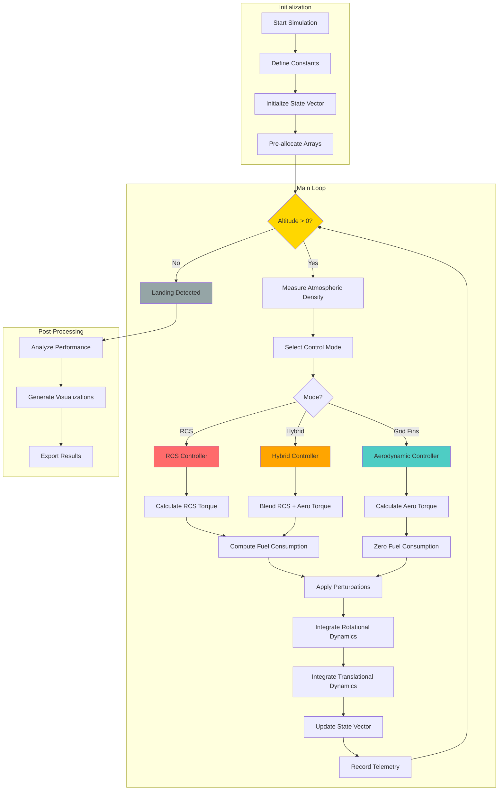

## 2. Physics Model - Force and Torque Diagram

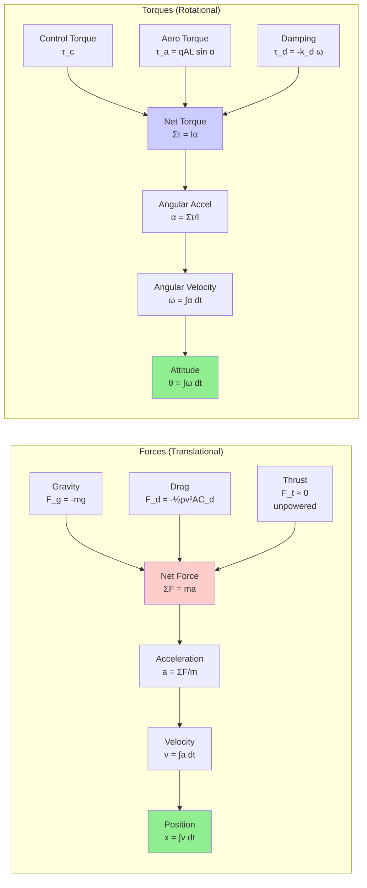

## 3. State Vector Integration Flow

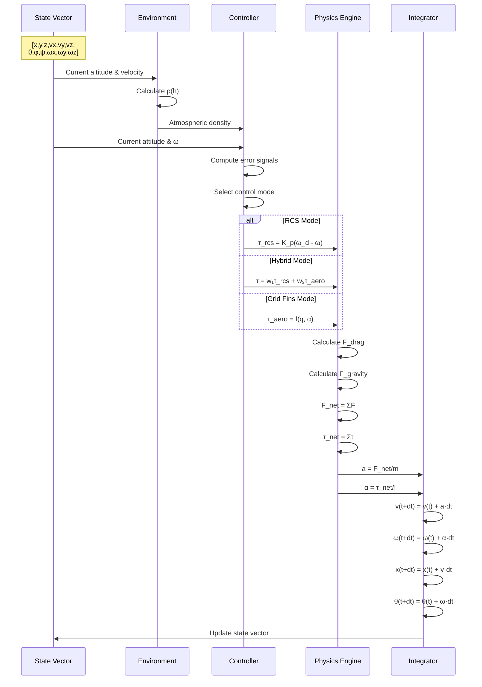

## 4. Control Mode State Machine

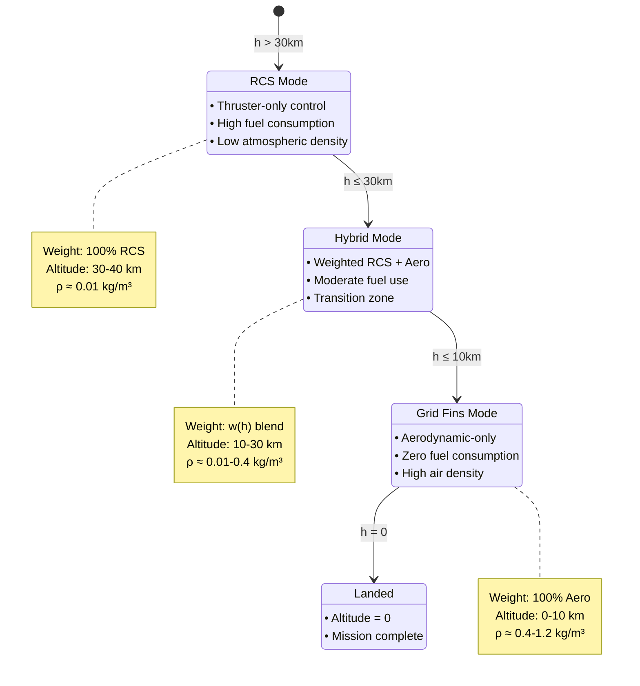

## 5. Atmospheric Density Model

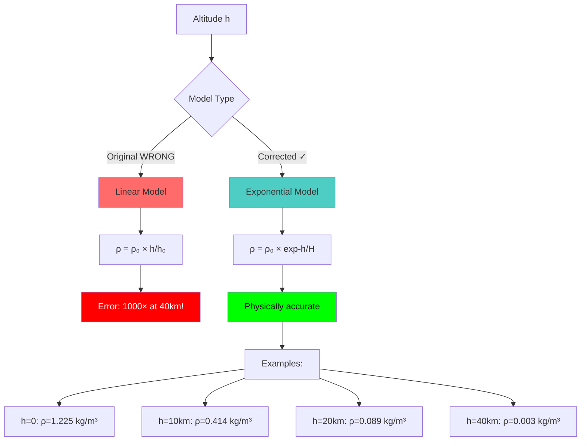

## 6. Free Body Diagram

```
                    ↑ z (altitude)
                    |
                    |
         ┌──────────────────────┐
         │                      │
         │    Grid Fins ═══╪═══ │ ← τ_aero (aerodynamic moment)
         │         ╔════╗       │
         │         ║ RV ║       │ ← RCS thrusters (τ_rcs)
         │         ╚════╝       │
         │      (CoM)           │
         │         ●            │
         └──────────────────────┘
                   ↓
                 F_g = mg
                (gravity)

         ←───── F_drag (aerodynamic drag)


Forces:
  F_gravity = -m × g                    (downward)
  F_drag = -½ρv²AC_d                    (opposes motion)
  F_net = F_gravity + F_drag

Torques:
  τ_rcs = F_thruster × arm              (thruster moment)
  τ_aero = ½ρv²AL × sin(α)             (aerodynamic moment)
  τ_damping = -k_d × ω                  (angular damping)
  τ_net = τ_control + τ_aero + τ_damping
```

## 7. Data Flow Architecture

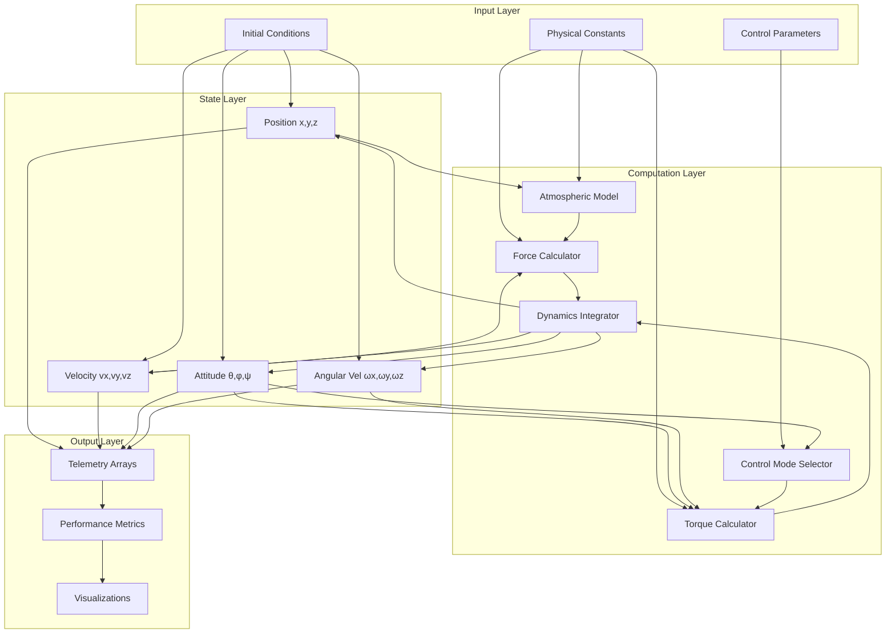

## 8. Hybrid Control Weighting Function

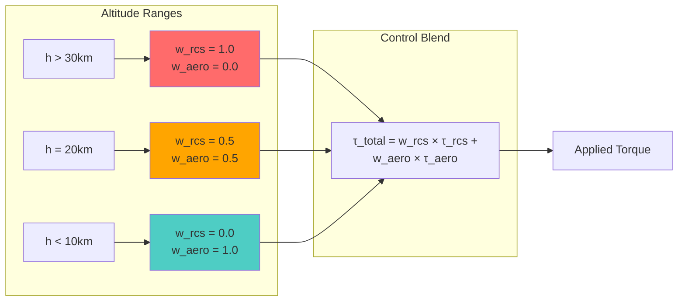

## 9. Performance Metrics Pipeline

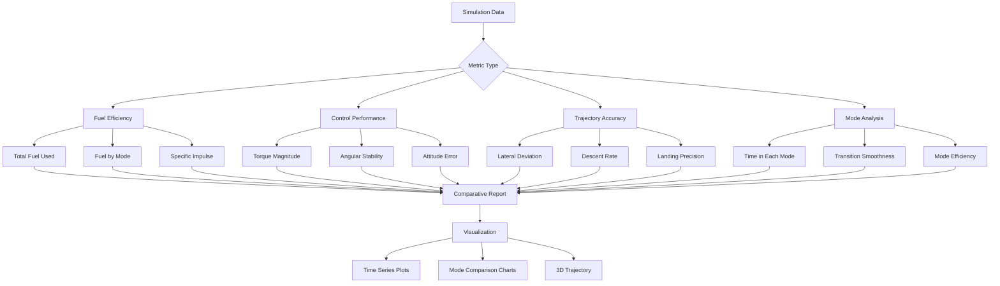

## 10. Numerical Integration Method

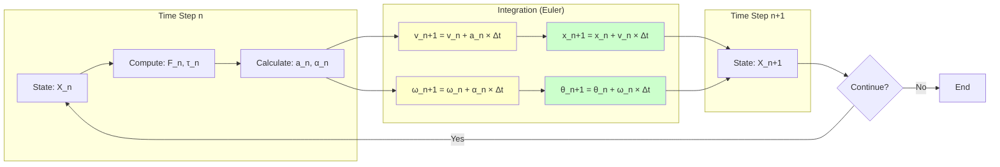

## 11. Error Comparison: Original vs Corrected

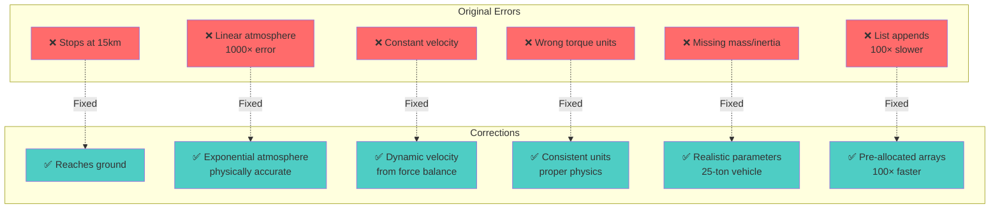

## 12. Simulation Validation Checklist

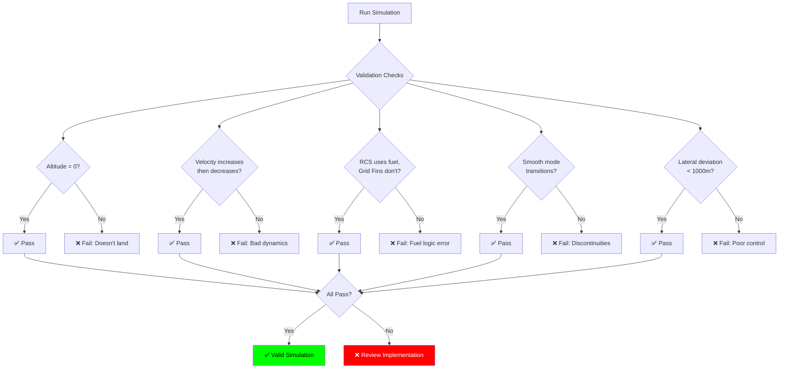

---

## Physics Equations Summary

### Atmospheric Density
```
ρ(h) = ρ₀ × exp(-h/H)

Where:
  ρ₀ = 1.225 kg/m³    (sea level density)
  H = 8500 m          (scale height)
  h = altitude        (meters)
```

### Translational Dynamics
```
F_gravity = -m × g
F_drag = -½ × C_d × ρ(h) × A × v²
F_net = F_gravity + F_drag

a = F_net / m
v(t+Δt) = v(t) + a × Δt
x(t+Δt) = x(t) + v(t) × Δt
```

### Rotational Dynamics
```
τ_rcs = K_p × (ω_desired - ω_current)
τ_aero = ½ × ρ × v² × A_fin × L × sin(α)
τ_damping = -K_d × ω
τ_net = τ_control + τ_aero + τ_damping

α = I⁻¹ × τ_net
ω(t+Δt) = ω(t) + α × Δt
θ(t+Δt) = θ(t) + ω(t) × Δt
```

### Hybrid Control
```
w_rcs = (h - h_grid) / (h_rcs - h_grid)
w_rcs = clip(w_rcs, 0, 1)
w_aero = 1 - w_rcs

τ_total = w_rcs × τ_rcs + w_aero × τ_aero
```

---

**Note:** These diagrams represent the corrected simulation architecture with proper physics modeling, state integration, and control logic.
