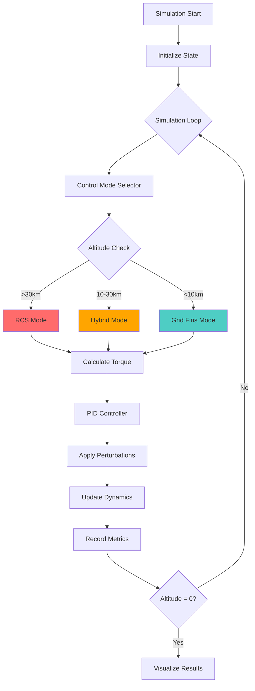
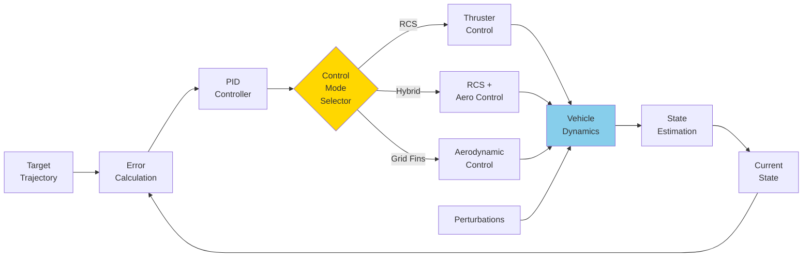
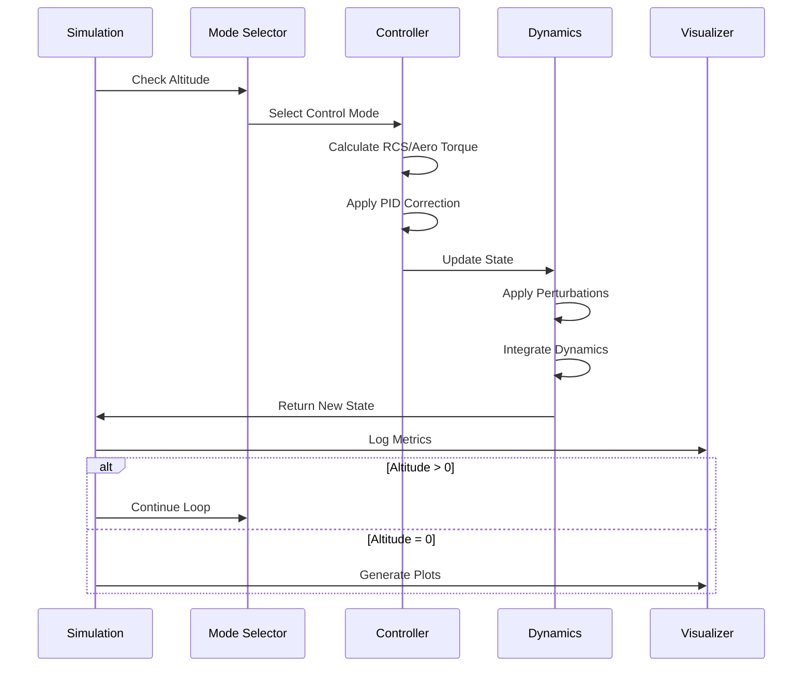
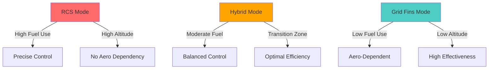

# Hybrid RCS & Aerodynamic Control Simulation for Reusable Launch Vehicles

A comprehensive simulation framework for analyzing and comparing control strategies for the descent phase of reusable launch vehicles (RLVs). This project models six-degrees-of-freedom (6-DOF) dynamics and evaluates RCS-only vs. Hybrid (RCS + Aerodynamic) control approaches.

## Table of Contents
- [Overview](#overview)
- [System Architecture](#system-architecture)
- [Key Features](#key-features)
- [Control Modes](#control-modes)
- [Installation](#installation)
- [Usage](#usage)
- [Simulation Parameters](#simulation-parameters)
- [Results and Metrics](#results-and-metrics)
- [Technical Details](#technical-details)
- [Contributing](#contributing)
- [License](#license)

## Overview

This simulation framework provides a testbed for studying altitude-based control transitions from vacuum to denser atmospheric conditions during RLV descent. It enables research into more efficient, robust, and adaptive control algorithms by comparing different control strategies and their impact on fuel consumption, torque dynamics, and trajectory accuracy.

### System Architecture



### Control Mode Transitions


## Key Features

### 🚀 6-DOF Dynamics
Accurate modeling of rocket position, velocity, attitude, and angular rates under varying atmospheric conditions.

### 🎮 Multiple Control Modes
- **RCS Mode**: Ideal at high altitudes (>30km) with low-density atmosphere, relying solely on thrusters
- **Hybrid Mode**: Blends aerodynamic surfaces with RCS thrusters for enhanced efficiency at transitional altitudes (10-30km)
- **Grid Fins Mode**: Aerodynamic control for low altitudes (<10km) with dense atmosphere

### 🎯 PID Control
Tunable PID controller adjusts control efforts dynamically to correct trajectory deviations and maintain stability.

### 📊 Comprehensive Metrics
- Fuel consumption tracking
- Torque magnitude analysis
- Lateral deviation measurement
- Control mode performance comparison

### 🔧 Open-Source and Extensible
Built with Python and open-source libraries, enabling easy modifications and integration of advanced techniques like machine learning-based optimization.

## Control Modes

### Control System Block Diagram



### Mode Selection Logic

| Altitude Range | Control Mode | Primary Control | Fuel Efficiency |
|----------------|--------------|-----------------|-----------------|
| > 30,000m | RCS Only | Thrusters (100%) | Low |
| 10,000-30,000m | Hybrid | RCS + Grid Fins (weighted) | Medium |
| < 10,000m | Grid Fins | Aerodynamic (100%) | High |

### Hybrid Control Weighting

In Hybrid mode, the control effort is distributed based on altitude:

```
weight_rcs = (altitude - 10000) / 20000
weight_grid = 1 - weight_rcs
total_torque = weight_rcs × rcs_torque + weight_grid × grid_torque
```

## Installation

### Requirements
- **Python 3.8+** (recommended)
- **Dependencies**:
  ```bash
  pip install numpy scipy matplotlib jupyter
  ```

### Quick Start
```bash
# Clone the repository
git clone https://github.com/yourusername/Space-System_term-paper.git
cd Space-System_term-paper

# Install dependencies
pip install -r requirements.txt

# Run the simulation
jupyter notebook sim.ipynb
```

## Usage

### Running the Simulation

1. Open `sim.ipynb` in Jupyter Notebook
2. Execute cells sequentially to run the simulation
3. View real-time plots of altitude, fuel usage, and torque dynamics

### Simulation Flow



## Simulation Parameters

### Configurable Constants

| Parameter | Default Value | Description |
|-----------|---------------|-------------|
| `TIME_STEPS` | 5000 | Number of simulation steps |
| `DT` | 0.1 s | Time step duration |
| `ALTITUDE_START` | 40,000 m | Initial altitude |
| `TARGET_ALTITUDE` | 0 m | Landing target |
| `AIR_DENSITY_SEA_LEVEL` | 1.225 kg/m³ | Sea level air density |
| `FIN_AREA` | 0.1 m² | Grid fin surface area |
| `PERTURBATION_INTERVAL` | 100 steps | Perturbation frequency |
| `PERTURBATION_MAGNITUDE` | 0.05 | Perturbation strength |

### PID Controller Tuning

```python
roll_pid = PIDController(
    kp=0.1,   # Proportional gain
    ki=0.01,  # Integral gain
    kd=0.05   # Derivative gain
)
```

## Results and Metrics

The simulation generates three key performance plots:

### 1. Sideways Deviation vs. Altitude
Tracks lateral deviation caused by perturbations across different control modes.

### 2. Fuel Usage vs. Altitude
Compares fuel consumption efficiency between RCS, Hybrid, and Grid Fin modes.

### 3. Torque Dynamics vs. Altitude
Analyzes control torque magnitude required to maintain stability.

### Performance Comparison



## Technical Details

### RCS Torque Calculation
```python
def rcs_torque(thruster_positions, thrust_forces):
    """Calculate torque from RCS thrusters using cross product."""
    return np.sum([np.cross(pos, force)
                   for pos, force in zip(thruster_positions, thrust_forces)],
                  axis=0)
```

### Aerodynamic Forces
```python
def aerodynamic_forces(velocity, angle_of_attack, air_density, fin_area):
    """Calculate lift and drag forces for Grid Fins."""
    lift = 0.5 * air_density * velocity**2 * fin_area * np.sin(np.radians(angle_of_attack))
    drag = 0.5 * air_density * velocity**2 * fin_area * np.cos(np.radians(angle_of_attack))
    return lift, drag
```

### State Variables Tracked
- Altitude (m)
- Velocity (m/s)
- Angular velocity (rad/s) - 3-axis
- Fuel consumed (units)
- Torque magnitude (Nm)
- Lateral deviation (m)
- Control mode (categorical)

## Contributing

Contributions are welcome! Areas for enhancement:
- Advanced control algorithms (LQR, MPC, reinforcement learning)
- More realistic atmospheric models
- 3D visualization of descent trajectory
- Wind disturbance models
- Multi-vehicle simulations

## License

This project is open-source and available under the MIT License. See [LICENSE](LICENSE) for details.

---

**Developed for research and educational purposes in aerospace control systems.**
